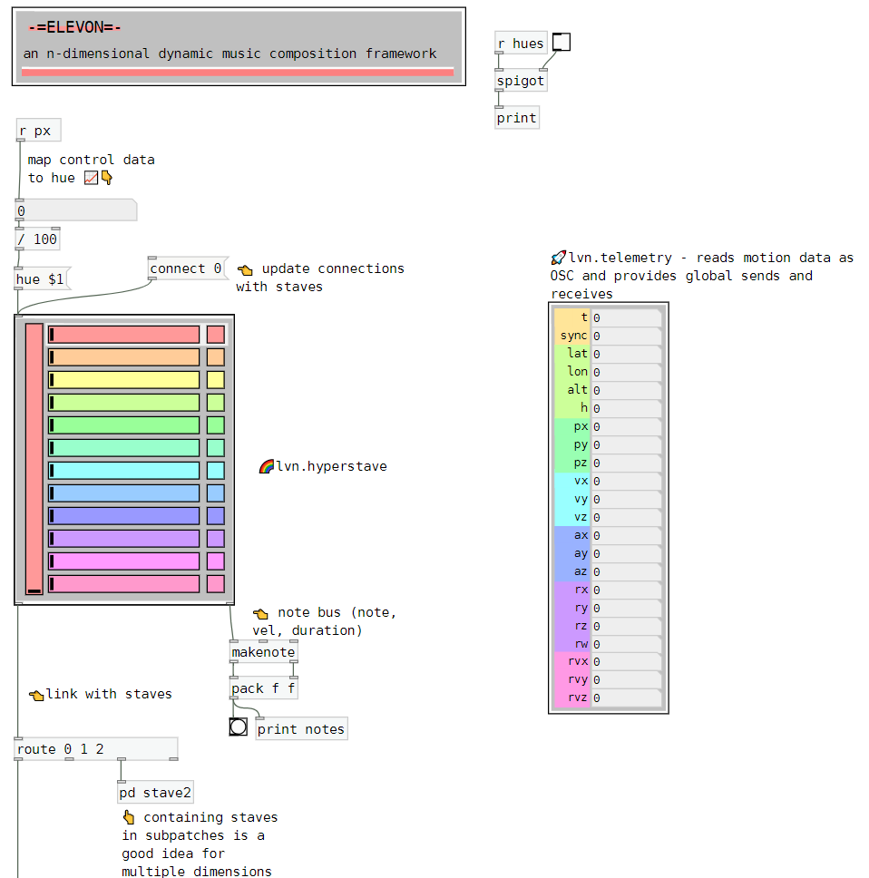

# elevon 🛩
## for Pure Data

*elevon* is a suite of modules for structuring non-linear musical compositions in Pure Data.  It allows composers to create complex heirarchical structures that respond to multiple sources of input data.  

---

elevon is the product of ongoing research.  Expect breaking changes and opaque usability for the time being.
